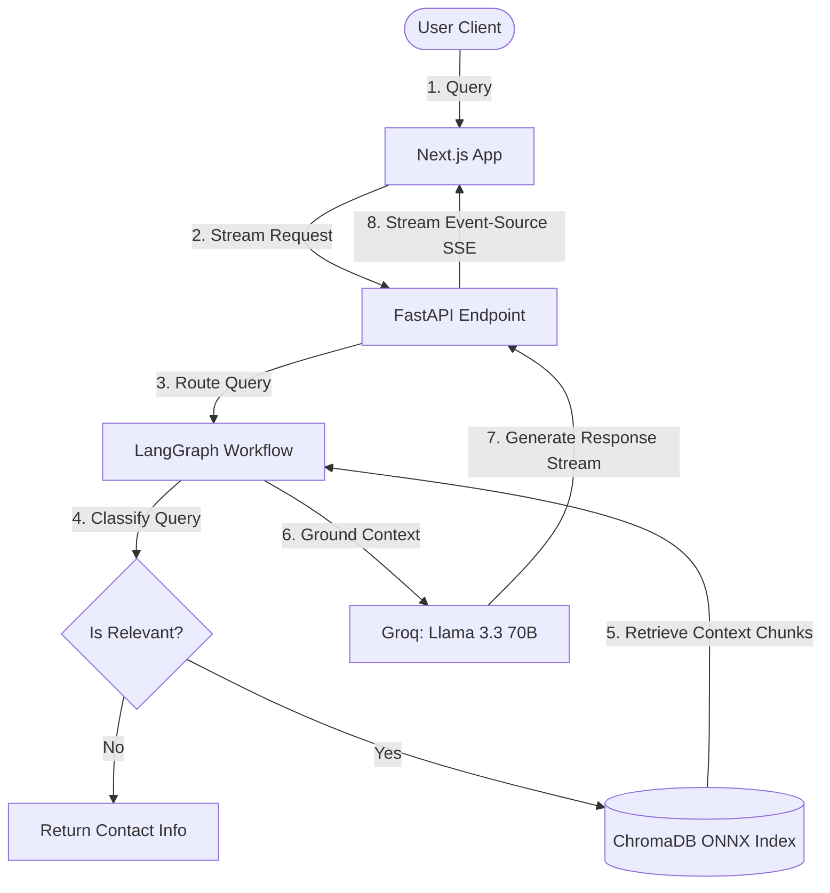

# 🤖 Jarvis OS — AI Portfolio Agent

A next-generation personal portfolio & recruiter-focused interactive workspace built for **Uttam Tiwari (AI Engineer)**. 

This repository is structured as a Monorepo containing:
* **Frontend**: A high-fidelity Next.js web application modeled after advanced AI operating systems, complete with DeepSeek R1-style "Thinking" states and Perplexity-style citation lists.
* **Backend**: A robust FastAPI RAG (Retrieval-Augmented Generation) microservice powered by LangGraph, ChromaDB, and Groq SDK.


---

## ⚡ Live Demos

* **Frontend (Vercel)**: [https://portfoliowithjarvis.vercel.app/](https://portfoliowithjarvis.vercel.app/)
* **Backend (Render)**: [https://portfolio-backend-yzzm.onrender.com/health](https://portfolio-backend-yzzm.onrender.com/health)


---

## 🧠 Key Features

1. **Stateful Chat Workflows (LangGraph)**: The backend utilizes a stateful LangGraph router to verify queries, decide if the question is relevant to Uttam's professional profile, query the vector DB, and stream context-grounded responses.
2. **DeepSeek R1-Style "Thinking" Logs**: Visually trace the model's multi-step cognitive reasoning layers (Query parsing -> Vector retrieval -> Context grounding -> LLM formulating) in real-time.
3. **Perplexity-Style Citations**: Automatic source citation showing exactly where in the knowledge base (resume, website details, or GitHub links) the information was extracted from.
4. **Zero-Overhead ONNX Embeddings**: Employs lightweight, CPU-optimized ONNX-based sentence transformers (`ONNXMiniLM_L6_V2`) integrated inside ChromaDB, bypassing memory-heavy PyTorch imports to run comfortably within a 512MB RAM server container.
5. **Interactive OS UI**: Clean dark-mode UI styled using TailwindCSS, framer-motion animations, custom terminal simulation, and Zustand state store.


---

## 🏗️ Architecture



---

## 🛠️ Project Structure

```
├── BACKEND/
│   └── backend/
│       ├── main.py                 # FastAPI Application Server
│       ├── rag/
│       │   ├── config.py           # Configs & Environment Loaders
│       │   ├── embeddings.py       # Custom ONNX Embeddings Interface
│       │   ├── ingest.py           # Document Ingestion Pipeline
│       │   ├── retriever.py        # ChromaDB Vector Store Singleton
│       │   └── workflow.py         # LangGraph Stateful Agent Workflow
│       └── requirements.txt        # Backend dependencies
├── src/                            # Frontend Next.js Source Code
│   ├── components/                 # React UI Components (Terminal, Command Center, Prompt Box)
│   ├── store/                      # Zustand State Management (useJarvisStore)
│   └── utils/                      # Helper scripts
├── package.json                    # Frontend dependencies
└── README.md
```

---

## 🚀 Setup & Run Locally

### 1. Prerequisites
Ensure you have **Node.js (v18+)** and **Python 3.10+** installed on your system.

### 2. Environment Variables

Create a `.env` file in the **`BACKEND/backend/`** directory:
```env
GROQ_API_KEY=your_groq_api_key
INGEST_SECRET=your_custom_ingestion_secret
FRONTEND_ORIGIN=http://localhost:3000
```

### 3. Running the Backend
```bash
# Navigate to the backend directory
cd BACKEND/backend

# Create a virtual environment & activate it
python3 -m venv venv
source venv/bin/activate  # On Windows: venv\Scripts\activate

# Install dependencies
pip install -r requirements.txt

# Run the ingestion script to populate ChromaDB
python3 -m rag.ingest

# Start the FastAPI server
uvicorn main:app --reload --port 8000
```
Verify the backend is live at [http://127.0.0.1:8000/health](http://127.0.0.1:8000/health).

### 4. Running the Frontend
```bash
# Navigate back to the root directory
cd ../..

# Install node dependencies
npm install

# Start the Next.js development server
npm run dev
```
Open [http://localhost:3000](http://localhost:3000) to interact with Jarvis OS.

---

## 🌐 Production Deployment

### Backend (Render Web Service)
* **Build Command**: `pip install -r requirements.txt && python -m rag.ingest`
* **Start Command**: `uvicorn main:app --host 0.0.0.0 --port $PORT`
* **Environment Variables**: Set `GROQ_API_KEY`, `INGEST_SECRET`, and `FRONTEND_ORIGIN` (pointing to your Vercel URL).

### Frontend (Vercel)
* **Framework Preset**: Next.js
* **Root Directory**: `./` (Root of the repo)
* **Environment Variables**: Set `NEXT_PUBLIC_API_URL` to point to the live Render backend URL.
